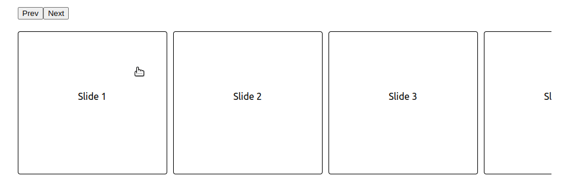

# react-freeslider

> A simple, performant, and cross-browser component for make beautifull free responsive slider.

## Installation

```bash
npm i react-freeslider
```

## Demo



## Usage

```js
import { useRef } from "react";
import FreeSlider from "react-freeslider";

const sliderWrap = {
  marginTop: 20,
  maxWidth: 900,
  margin: "auto",
};

const buttonsWrap = {
  marginTop: 20,
  marginBottom: 20,
};

const slideStyle = {
  width: 250,
  height: 140,
  borderStyle: "solid",
  borderWidth: 1,
  borderRadius: 4,
  borderColor: "black",
  textAlign: "center",
  paddingTop: 100,
};

function App() {
  const slider = useRef();

  return (
    <>
      <div style={sliderWrap}>
        <div style={buttonsWrap}>
          <button onClick={() => slider.current.prev()}>Prev</button>
          <button onClick={() => slider.current.next()}>Next</button>
        </div>

        <FreeSlider ref={slider}>
          <div className="slide" style={slideStyle}>
            Slide 1
          </div>
          <div className="slide" style={slideStyle}>
            Slide 2
          </div>
          <div className="slide" style={slideStyle}>
            Slide 3
          </div>
          <div className="slide" style={slideStyle}>
            Slide 4
          </div>
          <div className="slide" style={slideStyle}>
            Slide 5
          </div>
        </FreeSlider>
      </div>
    </>
  );
}

export default App;
```
